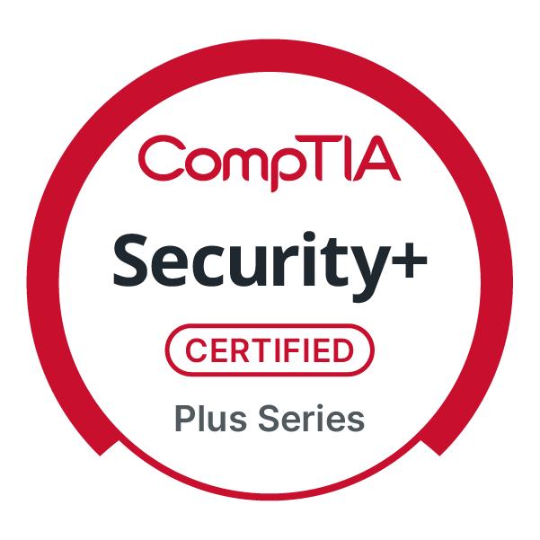
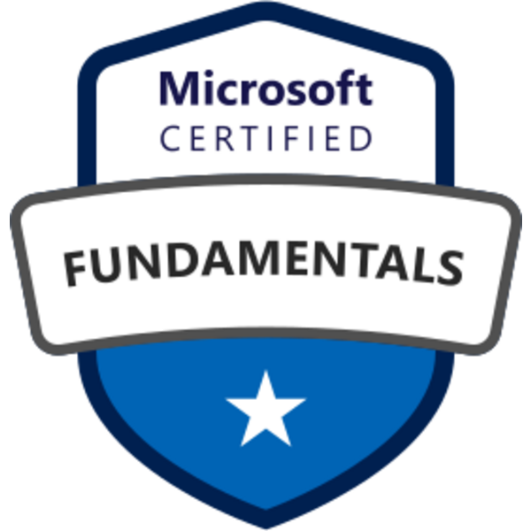

# Hi, I'm Siraj Mushtaq 👋

**CIS Student | Cybersecurity & IT | Network+ | Security+ | AZ-900 | SOC & Cloud Security**

---

## 👨‍💻 Cybersecurity Projects

• [Active Directory Help Desk Lab](https://github.com/cyber-siraj/active-directory-helpdesk-lab)

• SIEM Log Monitoring Lab (In Progress)

• Linux Security Lab (Planned)

• Network Packet Analysis Lab (Planned)
## 🧠 Certifications

CompTIA Network+  
CompTIA Security+  
Microsoft AZ-900  

---

## 📚 Currently Learning

• SIEM Fundamentals  
• Active Directory Security  
• Linux for Cybersecurity  
• Network Security Monitoring  

---

## 🎯 Career Goal

Aspiring **Security Operations Center (SOC) Analyst** with a strong foundation in networking, threat detection, and cloud security.

---

## 📫 Connect With Me

LinkedIn:  
https://www.linkedin.com/in/siraj-mushtaq-0a016b35a/
